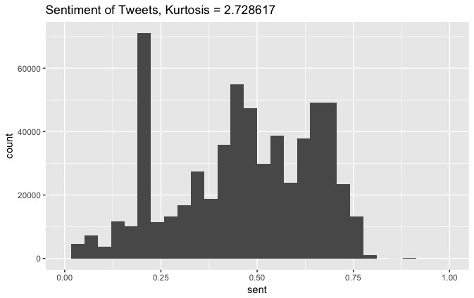
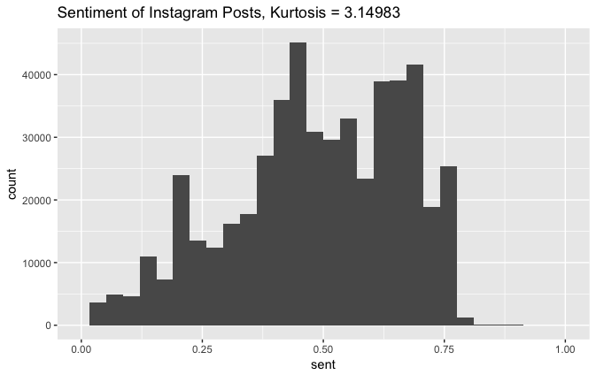

# _A Map For Finding Happiness_

No, this is not a self-help article. The title may have been misleading for people lacking the context, but it is extremely relevant to our project. Our team has set out to find how happy Singaporeans are. Yes, there are surveys done, but let's be honest, nobody likes doing surveys (both surveyers and surveyees). To surveyees, it is tedious and privacy imbreaching. To surveyers, it often comes with dishonest/inaccurate results. You can argue that resources can be spent to provide rewards for surveyees to motivate them and keep the data anonymous to ensure more accurate results. However, this is a waste of resources and keeping data anonymous can render the findings pointless. The data is only informative if we understand the context of where it is coming from, much like the title of this essay. It would be much more interesting to map the data to the social, geographical and economical background of the surveyees. We can then draw insights into what are the causes and effects of happiness of Singaporeans and learn more about people and culture about the country.

## Data Collection

If not surveys, how then can we collect data meaningfully and accurately? We may not be able to get direct sentiments from an individual but we can interpret this from their social behaviours. Their social media activity is a very informative place to begin obtaining data. _No, we do not condone the actions of Cambridge Analytica._

While the ethics of secretly obtaining data and using it for evil means (like trying to ruin a country by instating terrible leadership) is questionable, our team is in no way trying to sway any opinions here (other than trying to sway the opinions of our professor to give us an 'A').

**Disclaimer:** the data we have obtained are all available before we started. Everything is done under the Singapore law (currently) and guidelines of the social media companies. We got our tweet data from our Professor, Ate Poorthuis [1], and Instagram posts are obtained from open Instagram APIs [2]. 

## Using Emoji Data

Now that the true context of this article has been fully established, how then can we make sense of data taken from social media? Scraping posts would mean that a complicated algorithm has to be used to understand the linguistic habits of people. Singapore is a diverse country with many languages. Singaporean English can be difficult to decipher with the basic linguistic understandings. Vocabulary, grammar and sentence structures from all the different cultures of Singapore has meshed into a giant pot of mess called Singlish. Trying to sieve out meaning from Singapore social media is like trying to understand animal chatter in a barn. That is why our group decided to use widely understood icons and symbols as references for our data. We have decided to look at emojis in social media posts to summarise their contents. It is unlikely to find a sad post with a bright smiling emoji (as that would just be socially confusing), so it gives a pretty accurate benchmark for how happy the post is. We can then assign scales of happiness to the different emojis and obtain a quantifiable measurement. This measurement is taken from a study done on sentiment ranking of emojis [3]. Other information like the location of the post can also be obtained to find out the context of the user and post.

## Data Distribution

We plotted a histogram of the Twitter and Instagram sentiments that we collected. We found out that they generally follow a similar distribution, although Instagram posts are more heavy tailed (more positive sentiments).

    

    

## Conclusion

Now that we have the data of happiness scattered around Singapore, how can we model and visualise the data to draw meaningful insights? To find the cause of happiness levels, our team came up with a few categories to compare happiness around Singapore. We wanted to find out if location, time or financial background have any effect on happiness levels of Singaporeans. We then visualise our findings on the map of Singapore to better understand any correlations.

## References

##### [1] https://hass.sutd.edu.sg/faculty/ate-poorthuis/
##### [2] https://www.instagram.com/developer/
##### [3] http://kt.ijs.si/data/Emoji_sentiment_ranking/